<!-- Banner -->
<h1 align="center">Naz Zaamout</h1>

  
  
  
  

  <b>Full-Stack Software Developer</b> · <b>AWS Certified Cloud Practitioner </b> · <b>Founder of TekBloom</b> · <b>Contractor</b> · <b>IoT & Cloud Enthusiats</b>

<i>“Coding with purpose. Designing with care.”</i>

---

<h3 align="left">
  
</h3>

  
  
  

I'm a detail-oriented software developer and creative problem solver, with a passion for developing mobile applications, IoT/cloud integrations, and scalable backends.

🎓 Graduate of SAIT (3.9 GPA · Dean’s List · Student Excellence Award · Jason Lang Scholarship)  
🌱 Building solutions that blend **practical functionality** with **delightful UX**

- 🚀 **Currently Working On:**  
  - **MobileApp** – Mobile application (React Native + TypeScript + PostgreSQL + Azure)  
  - **Sprout** – Smart plant care IoT app with sensors, AWS backend, and analytics dashboard  
- 🧠 **Skills In Action:** React Native · Node.js (Express/Sequelize) · PostgreSQL · AWS · Azure · Docker · CI/CD  
- 💬 **Ask Me About:** scalable backends · IoT integrations · offline-first workflows  
- 🍬 **Fun Fact:** I debug better when I have Skittles 🌈

---

<h3 align="left">
  
</h3>

> 🚧 Note: Most repos are private for client work or school — available on request/demo (school repos only)

🏢 Mobile Application (2025 – present)

- Contract engagement for a Western Canadian property management firm.
- **Lead full-stack developer**: mobile app, backend APIs, deployment pipelines.
- Features: secure auth, offline-ready sync, rich media capture, role-based access, PDF generation.  
- **Stack:**    

  

🌿 Sprout: Plant Care Tracker (2024 – 2025)

- IoT-driven plant care app with schedules, sensor analytics, and task streaks.  
- Built with **React Native + Node.js + MongoDB**, sensors via **Raspberry Pi + Zigbee** into **AWS IoT Core**.  
- Recently migrated ingestion to AWS + added analytics dashboard.  
- **Stack:**    

⚡ Tesla Autopilot Risk Analyzer (2025)

- Predictive analytics backend to simulate Autopilot failure risk.  
- Inputs: GPS, traffic, weather, speed.  
- Built with Node.js, Express, and MQTT. 

🎧 Tuneify: Music Player App (2024)

- Cross-platform React Native music app
- Features: playlists, theming, polished UI/UX

📚 BookFoo: Book Search Webpage (2024)

- React web app to browse/search books from APIs.  
- Save favourites, interactive browsing. 

💻 Java ADT Implementation (2024)

- Created custom Stack & Queue data structures using Java
- Simulated real-world XML parsing with object-oriented principles
- Included unit testing using JUnit for reliability  

✈️ Traveless · 🛠️ Appliances Inventory · 🌙 LumiJournal (2024)

- Academic projects showcasing .NET MAUI, Blazor, OOP principles, and journaling UI/UX.  

---

<h3 align="left">
  
</h3>

- 🎓 **2024** – Enrolled in Software Development @ SAIT  
- 🏆 **2024** – Won Student Excellence + Jason Lang Scholarship  
- 🌱 **2024** – Led Sprout + multiple cross-platform apps
- 🎓 **2025** – Graduated SAIT Software Development Diploma (3.9 GPA, Dean's List)
- 🎓 **2025** – Earned AWS Certified Cloud Practitioner
- 🚀 **2025** – Contractor · Advancing Sprout with AWS migration · Building a new stealth project  
- 🔮 **Next:** Public Launch of Sprout · Expand stealth project · Contribute to OSS  
  
---

<h3 align="left">
  
</h3>

#### 👩‍💻 Languages & Frameworks

#### 🖥️ Development Tools & IDEs

#### 🎨 UI & Styling

#### 🗃️ Databases & Cloud

#### 🧪 Testing, DevOps & CI/CD

#### 🌱 IoT, Data & Misc

---

<!-- 🧙‍♀️ GitHub Metrics -->

  

---

  Founder of <b>TekBloom Software Solutions</b> · Building Sprout · Contracting Mobile App · Innovating Stealth Project

<i>“Sprout small. Grow strong.”</i> 🌱

— Naz Zaamout

